## Part 1. Running multiple docker containers using docker compose

1) Write a Dockerfile for each individual microservice. The necessary dependencies are described in the materials. Write the size of the built images of any service in the report in different ways.

Dockerfile for services:

   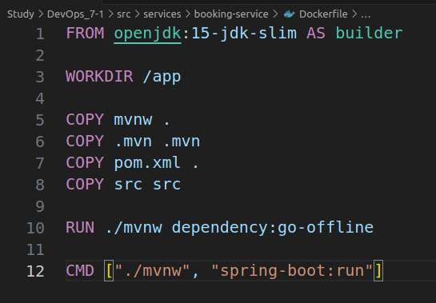

Database-service:

   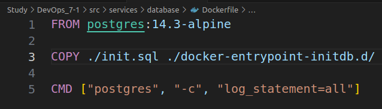

Images size:

   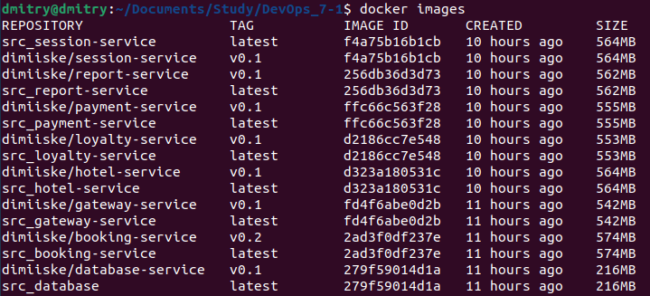


2) Write a docker-compose file that performs a correct interaction of services. Forward ports to access the gateway service and session service from the local machine. 

   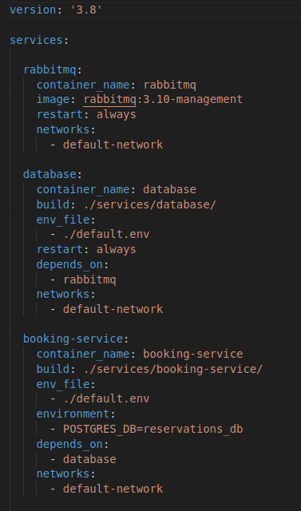
   
   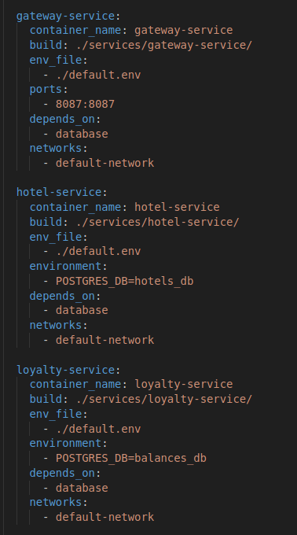

   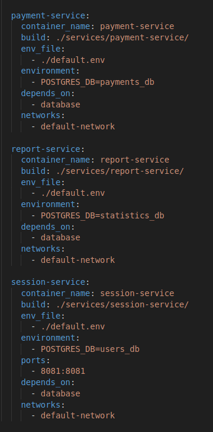

3) Build and deploy a web service using a docker compose file written on the local machine.

   ``` docker-compose -f ./Part1/docker-compose/docker-compose_local.yml build ```

   ``` docker-compose -f ./Part1/docker-compose/docker-compose_local.yml up -d ```

4) Run the tests you have prepared through postman and make sure they are all successful. You can find instructions on how to run the tests in the materials. Write the test results in the report.

   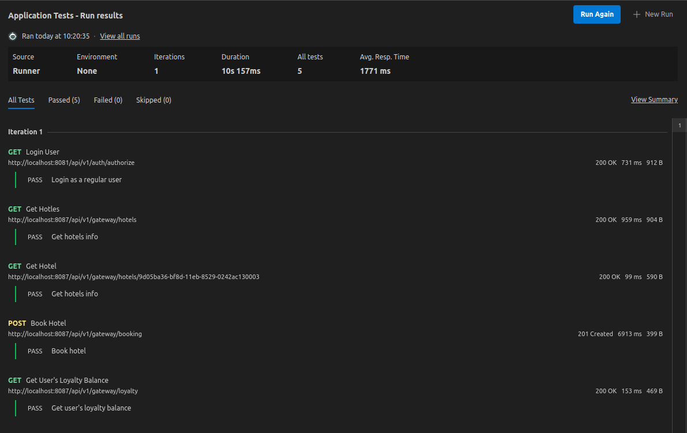
   
## Part 2. Creating virtual machines

1) Install and initialize Vagrant at the root of the project. Write a Vagrantfile for one virtual machine. Move the source code of the web service to the virtual machine's working directory.

Initialize VM:

   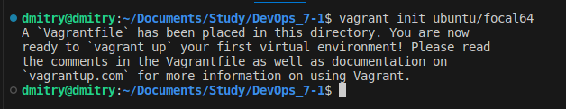

Starting VM:

   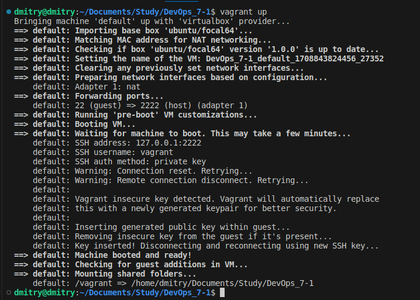


2) Use the console to go inside the virtual machine and make sure that the source code is in place. Stop and destroy the virtual machine.


   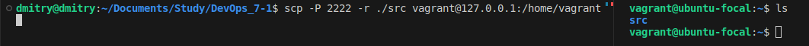

   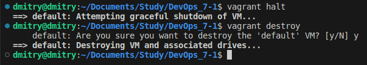

## Part 3. Creating a simple docker swarm

1) Modify Vagrantfile to create three machines: manager01, worker01, worker02. Write shell scripts to install docker inside machines, initialize and connect to docker swarm.

   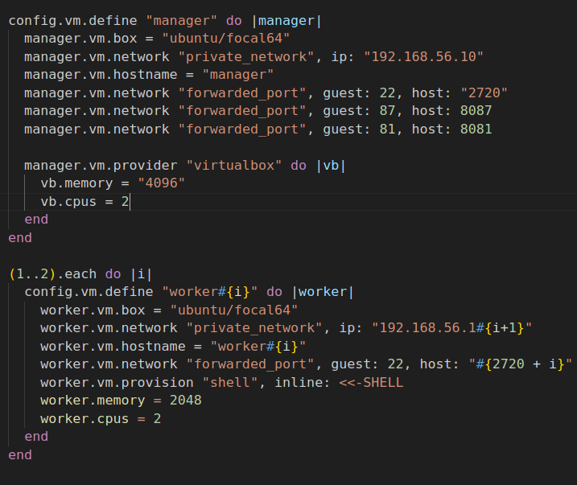

Shell-script:

   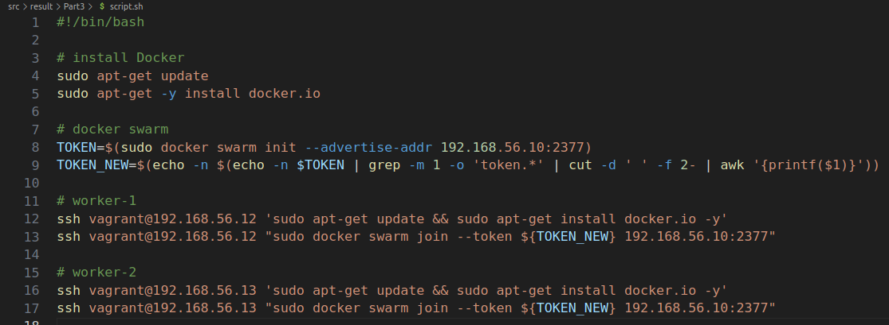


2) Load the built images on the docker hub and modify the docker-compose file to load the images located on the docker hub.


   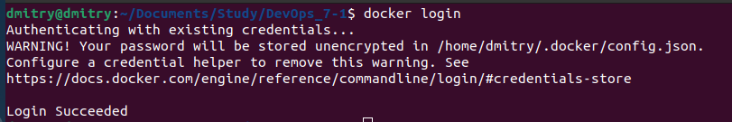

   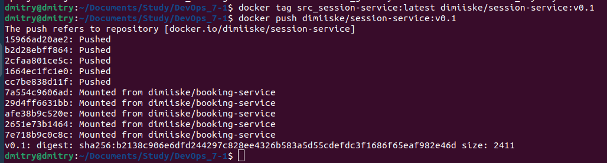

   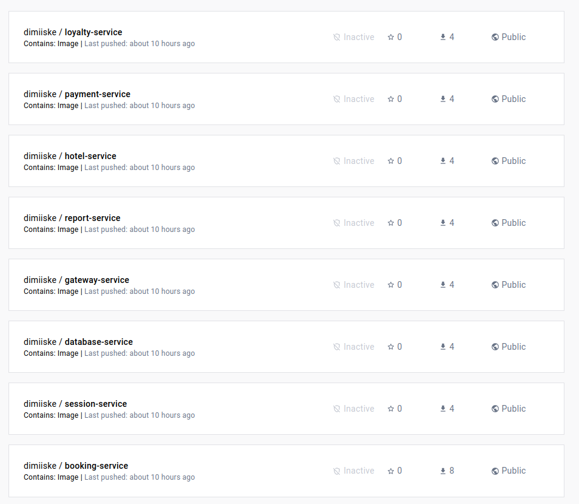

Modified docker-compose file:
   
   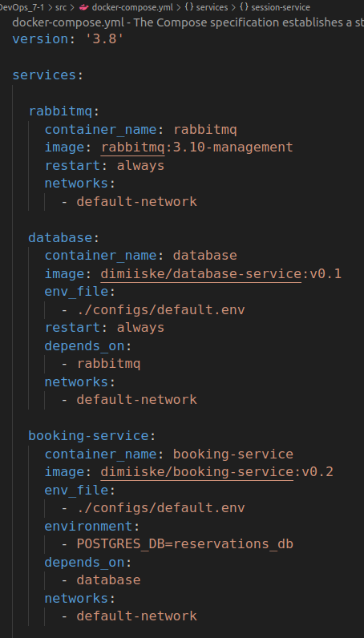

   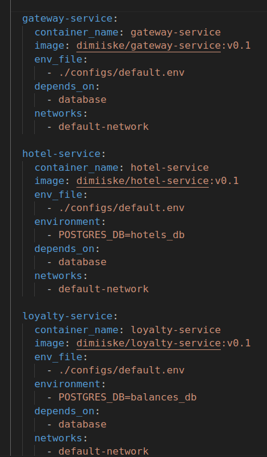

   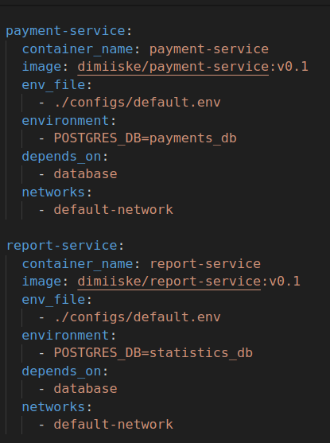

   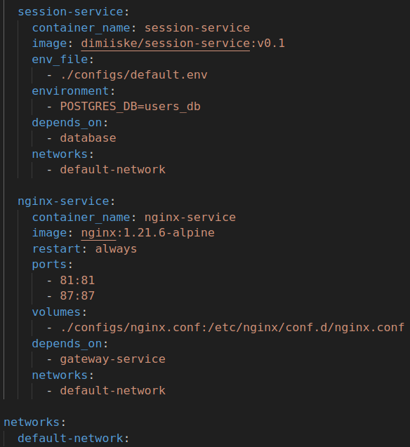

3) Run virtual machines and move the docker-compose file to the manager. Run the service stack using the docker-compose file you wrote.

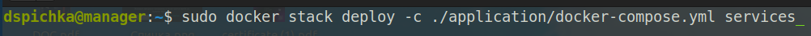

However, when deploying the Docker Swarm stack, the laptop could not cope with the load.

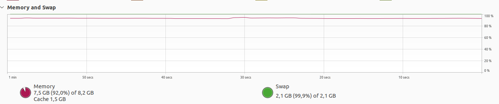

I had to set up servers on one of the cloud servers. Change addresses in shell script and Postman.

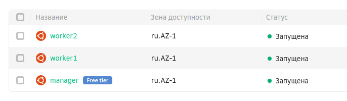

4) Configure an nginx-based proxy to access the gateway service and session service via the overlay network. Make the gateway service and session service themselves unavailable directly.

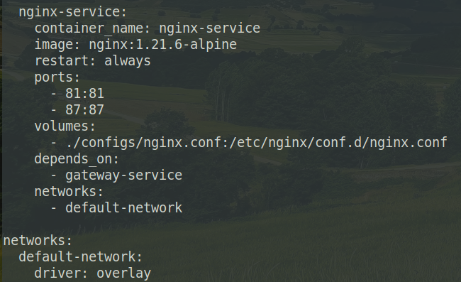

5) Run the prepared tests through postman and make sure that they are all successful. Write the test results in the report.


6) Using docker commands, show the distribution of containers by nodes in the report.

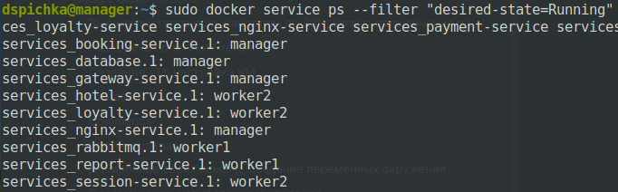

7) Install a separate Portainer stack inside the cluster. Show a visualization of the distribution of tasks over the nodes using the Portainer in the report.

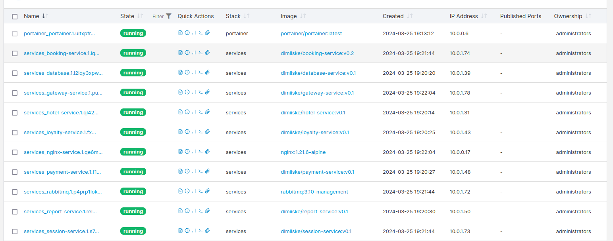


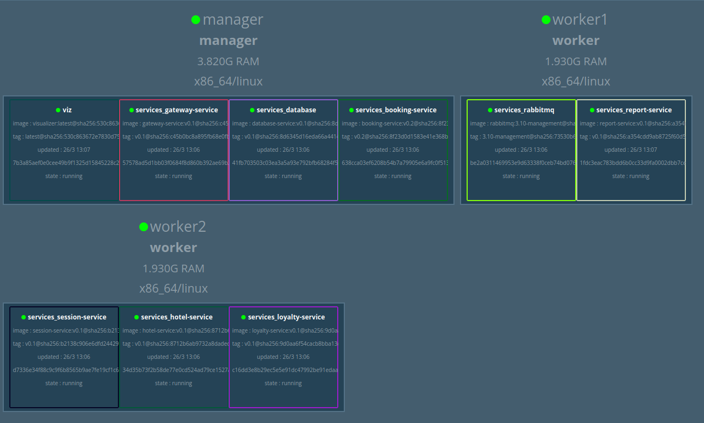